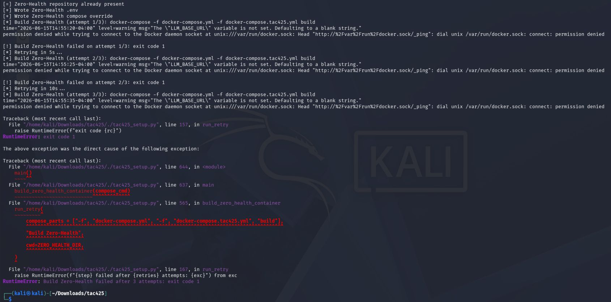
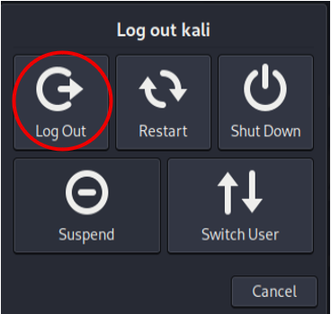

# TAC425 Deployment Guide

This guide is made to help with the install of the University of Southern California's (USC) TAC 425 Web Application Security course material

## 1) Instructions

Ensure you have an install of Kali Linux 2024 or above running in a VM session of some kind. Personally, I use UTM in my MacBook and VirtualBox on my Windows Machine
Git the TAC425 setup script from github:
	https://github.com/hacktivcyber/tac425
from a terminal session within Kali do the following:

1. cd ~/Downloads
1.git clone https://github.com/hacktivcyber/tac425.git 
1.	cd ./tac425
1. python3 ./tac425_setup.py
    1. It will install ALL the basic things you will need for the Labs into the ~/TAC425 folder.
    1. It will take approx. 30 min total & about 5 GB
1.	You may encounter a “RunTimeError: exit code 1”
    1. This is related to the currently logged in account not being recognized as being in the docker group. Even though your account is added to the docker group during the install, the OS doesn't recognize this until a relog occurs.
   
The error looks something like this:

    
 ii. Just log out and log back in

 iii. Restart a terminal session & rerun the python./tac425_setup.py. It will pick up where it left off.

- Wordlists (courtesy of SecLists) are in ~/TAC425/wordlists
- Docker Container Start/Stop Scripts are in ~/TAC425/container_scripts
